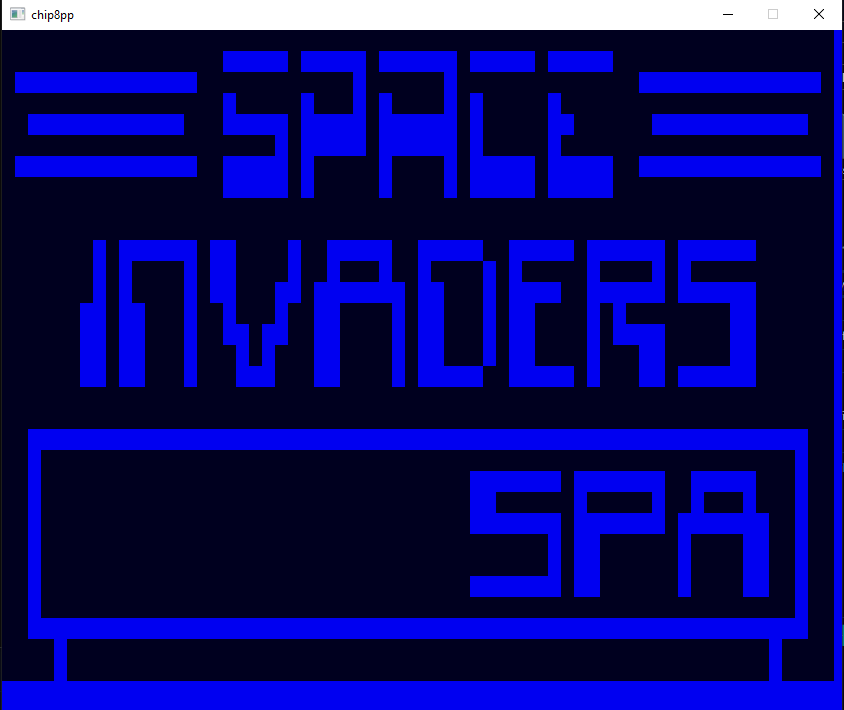

# CHIP-8 Emulator (C++ / SDL2)

A CHIP-8 emulator written in modern C++ using SDL2.

## Features

- Fully working CHIP-8 interpreter (tested with **Space Invaders**)
- Fetch, decode, and execute of all opcodes
- Keyboard input mapped to CHIP-8 hex keypad
- Graphics rendering using SDL2
- delay timers implemented (sound to be implemented)
- CPU cycle and main loop logic based on real CHIP-8 specs

> **ROM path is currently hardcoded in the source code.**
> To use another rom, renamed it to **current.ch8** and place it in /rom.  
> A future update may include a simple GUI or file selector to load `.ch8` ROMs manually.

---

##  Prerequisites

- **C++17** or higher  

### build Windows

- **extract content of libs.zip into (create if needed) the libs/ folders in to root directory and extract content**
-  The CMakeList.txt will do to the rest.

##  How to Run

Download the last realease zip file, place the rom you want to test by renaming it to "current.ch8" and replacing the one present (which is space invaders).
Start the .exe

## Input

Keys:

<kbd>1</kbd> <kbd>2</kbd> <kbd>3</kbd> <kbd>4</kbd>

<kbd>A</kbd> <kbd>Z</kbd> <kbd>E</kbd> <kbd>R</kbd>

<kbd>Q</kbd> <kbd>S</kbd> <kbd>D</kbd> <kbd>F</kbd>

<kbd>W</kbd> <kbd>X</kbd> <kbd>C</kbd> <kbd>V</kbd>

---

## Author

👤 **8touzine**  
GitHub: [github.com/8touzine](https://github.com/8touzine)

---

## License

MIT License

Copyright (c) 2025 8touzine
